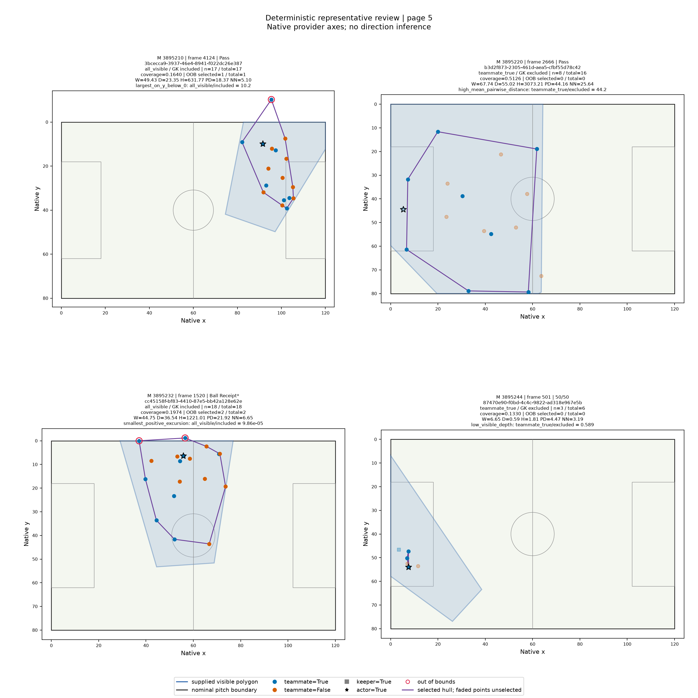
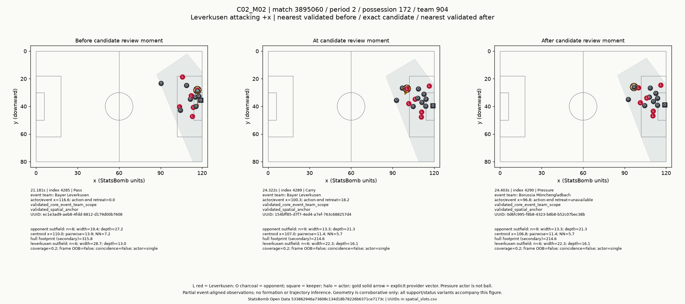
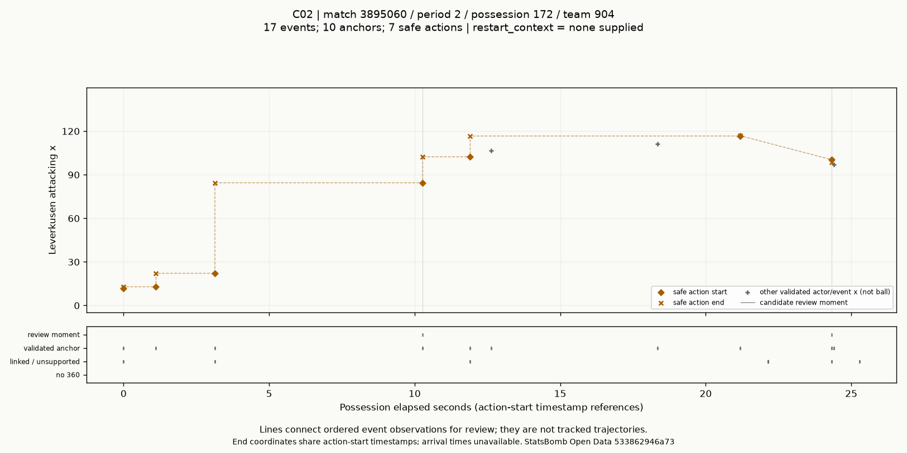
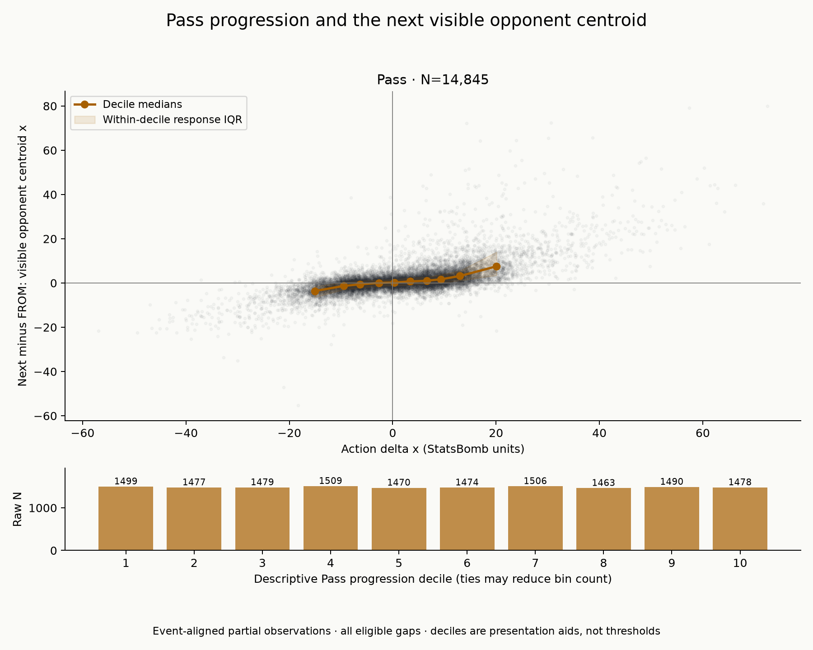
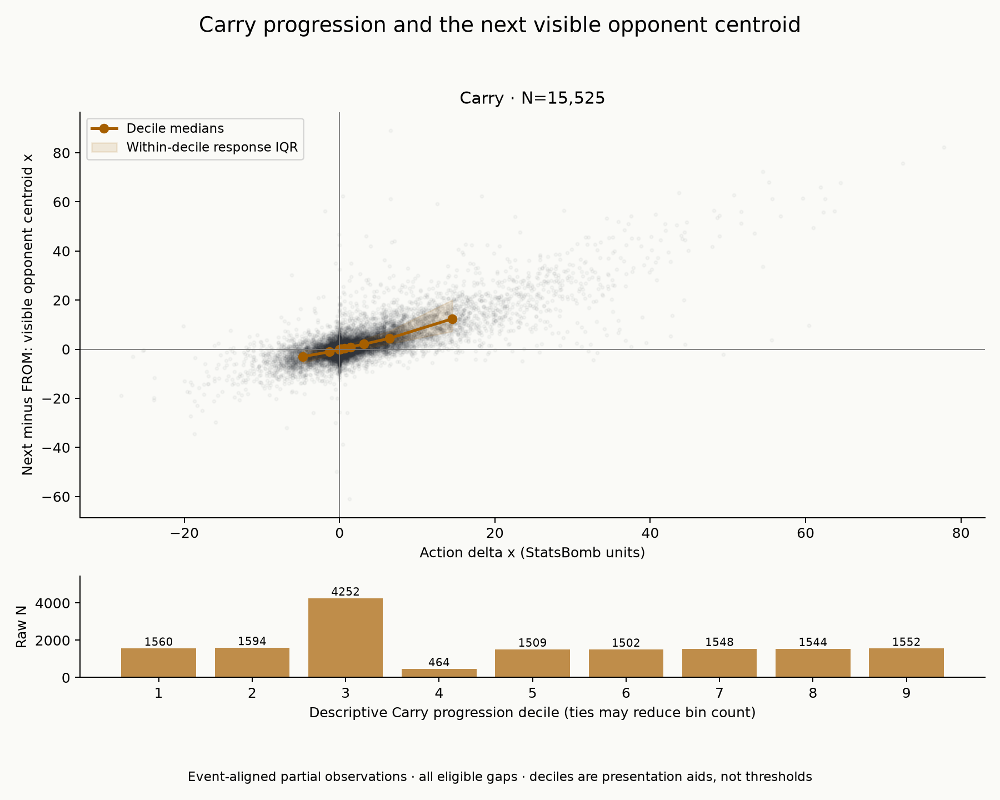
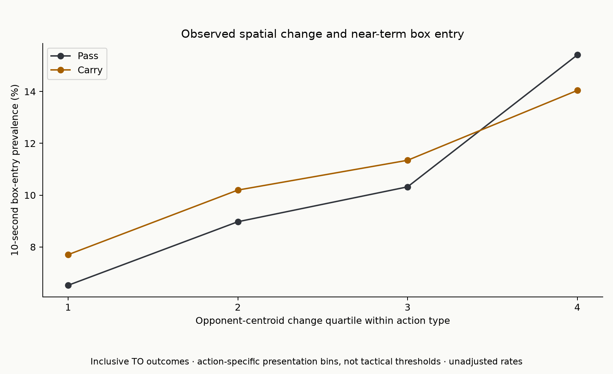
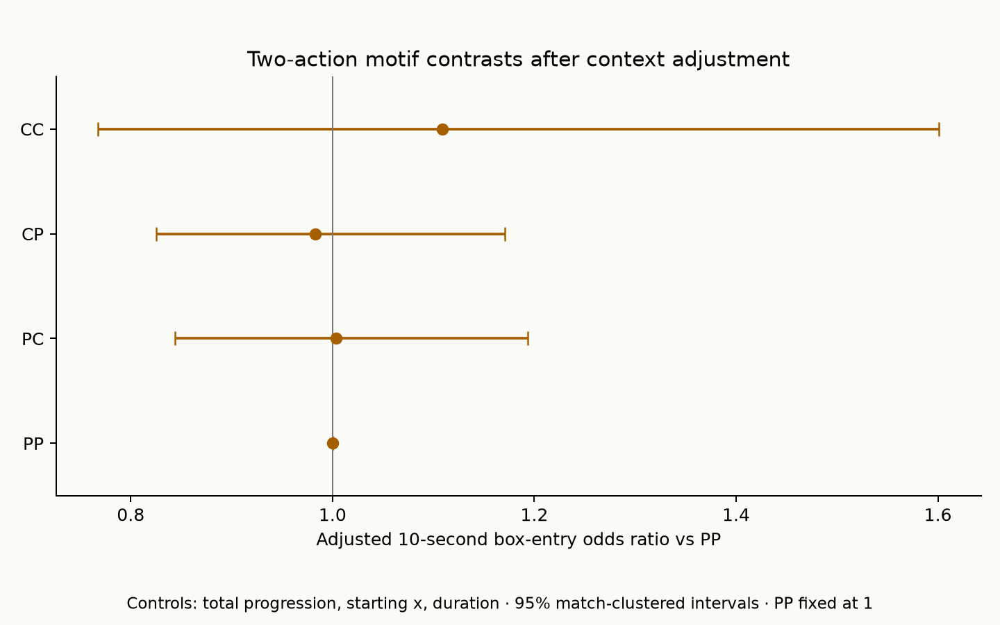
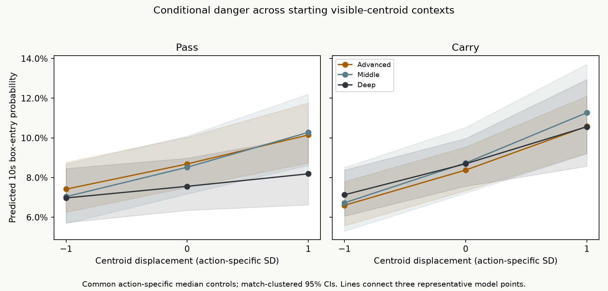

# Bayer Leverkusen 2023/24: How Progression Changed Visible Defensive Space

### A spatial data-science case study using StatsBomb event and 360 data

Bayer Leverkusen completed the 2023/24 Bundesliga season unbeaten. I used their season as a case study to investigate a narrower analytical question:

> **How did Leverkusen's attacking actions alter the visible spatial structure of the opposition, and which recurring changes were associated with dangerous attacks?**

I also wanted to test a common tactical intuition: were particular short Pass/Carry sequences especially effective, or did the underlying amount of progression and resulting spatial displacement explain more of the danger?

The project ultimately analyzed all **34 Bundesliga matches**, combining StatsBomb event data with event-aligned StatsBomb 360 freeze frames.

The strongest result was not a single "best" attacking sequence. Instead, the evidence pointed toward a broader mechanism:

> **Forward progression was consistently associated with longitudinal displacement of the visible opponent structure, and larger opponent-centroid displacement was associated with greater near-term box-entry danger even after accounting for the amount of ball progression itself.**

Carries showed an especially strong descriptive relationship with longitudinal spatial change.

---

## The analytical challenge: 360 is not tracking data

StatsBomb 360 provides a freeze frame around selected events. Each frame contains the players visible to the provider at that moment and a polygon describing the visible area of the pitch.

That creates a fundamental measurement problem.

A 360 frame does **not** necessarily contain all 22 players. Different portions of the pitch can be visible from one event to the next, and ordinary off-ball players are anonymous. A change in measured team geometry can therefore reflect both football movement and a change in what was observable.

I treated the 360 data as **event-aligned partial spatial observations**, not reconstructed tracking data.

*Representative Phase 2 diagnostic frames. The blue region is the supplied visible-area polygon; points are visible players and the purple outline shows the selected observed convex-hull footprint. These examples illustrate why spatial support had to be evaluated rather than assuming each frame represented a complete team shape.*

This distinction shaped the entire project. I did not attempt to infer complete formations, continuous defender trajectories, player velocities, true pitch control, or full-team occupied space from incomplete snapshots.

Instead, I asked a narrower question:

**What can be measured reliably from the players who are actually visible at each event?**

---

## Step 1 — Establish a trustworthy data foundation

Before analyzing tactics, I audited the source data and the event-to-360 relationship across the entire season.

The initial audit exposed an important reproducibility problem: later versions of the public StatsBomb repository contained incompatible event and 360 UUIDs for several matches. Rather than heuristically relinking records, I identified and pinned the project to a historical StatsBomb revision where the event and 360 datasets were mutually compatible.

The resulting source contained:

| Analytical layer                | Observations |
| ------------------------------- | -----------: |
| Full-season events              |      137,765 |
| Uniquely linked 360 frames      |      118,581 |
| Validated semantic frames       |       72,596 |
| Attacking control spells        |        3,202 |
| Trusted spatial anchors         |       43,737 |
| Within-spell transitions        |       40,638 |
| Eligible Pass/Carry transitions |       30,375 |
| Two-action windows              |       24,273 |
| Three-action windows            |       19,651 |

Every downstream phase used the same immutable source revision.

---

## Step 2 — Turn freeze frames into interpretable spatial measurements

For validated frames, I calculated simple, interpretable geometry from visible players rather than introducing a complex spatial model.

The primary opponent measurements were:

**centroid position, visible width, visible depth, pairwise spacing, nearest-neighbor spacing**, with the observed convex-hull footprint retained as a secondary measure.

Goalkeepers were excluded from the primary structural geometry.

The key measurement in the final analysis was the **visible opponent centroid**: the average location of the visible opponent outfield points. After orientation normalization, Leverkusen always attacks toward increasing x.

A positive change in opponent-centroid x therefore means:

> the average location of the **visible opponent players** in the next observation was farther toward their own goal.

It does **not** mean that a complete defensive line was observed retreating.

---

## Step 3 — Construct attacking units without inventing tactical boundaries

Provider possession IDs were useful context, but they were not always equivalent to uninterrupted Leverkusen attacking control. Opponent interventions and other football events could occur within the same provider possession.

I therefore developed an **attacking control spell**:

> a contiguous interval in which Leverkusen retains or repeatedly re-establishes attacking control until a qualifying hard football boundary occurs.

Hard boundaries included established opponent control, the ball going out of play, stoppages, and qualifying terminal shot situations.

During development, I also tested whether tactical "soft resets" such as large retreats or recycling phases should split attacks into smaller episodes.

That approach was rejected.

Three successive reset-rule versions improved on the reviewed examples, but even the best version still created too many false splits. Rather than continue tuning the rules until they produced a desirable tactical story, I removed soft resets from the production segmentation method.

The final hard-boundary implementation reproduced all **27 scored human-reviewed boundaries**: 24 exact onsets and three accepted paired-record timing differences.

The result was **3,202 attacking control spells** across the season.

---

## What an event-aligned spatial sequence looks like

The following example shows three validated spatial observations around a Leverkusen Carry.

*The panels show the nearest validated observation before the event, the event itself, and the next validated observation. The shaded region is the visible area. These are ordered freeze frames, not frames from continuous tracking footage.*

This distinction matters. The project measures how the **observed spatial state changes between event-aligned observations**. It does not claim to know the exact path each defender traveled between them.

The same review process also examined how Leverkusen's attacking x-position developed through event sequences and where validated spatial observations were available.

*An example methodological review plot. Diamonds and x-marks represent recorded action starts and ends; the lower strip shows where 360 observations were available and semantically validated. Connecting lines summarize ordered event observations and are not player or ball trajectories.*

These reviews were important because they prevented a methodological shortcut: simply treating every provider possession as one homogeneous tactical sequence.

---

# Finding 1 — Progression was strongly associated with longitudinal opponent displacement

With the spatial sequence layer established, I examined one eligible Leverkusen Pass or Carry at a time.

For each action:

$$
\text{FROM spatial state}
\rightarrow
\text{Pass or Carry}
\rightarrow
\text{next trusted TO spatial state}
$$

I measured action progression as the explicit StatsBomb action endpoint x minus its starting x, then measured spatial change as:

$$
\Delta \text{geometry}
=
\text{geometry}_{TO}
-
\text{geometry}_{FROM}
$$

No outcome information was used in this phase.

### Passes

For **14,845 Pass transitions** with complete opponent-centroid measurements:

* Spearman correlation: **0.622**
* linear slope: **0.349**
* \(R^2 = 0.422\)

Greater forward Pass progression was consistently associated with a deeper next-observed opponent centroid.

### Carries

For **15,525 Carry transitions**:

* Spearman correlation: **0.648**
* linear slope: **0.831**
* \(R^2 = 0.604\)

The Carry relationship was descriptively much steeper than the Pass relationship.

This does **not** mean that replacing a Pass with a Carry would causally move defenders farther backward. Passes and Carries occur in different football situations.

The correct interpretation is narrower:

> **More progressive Carries were associated with especially large longitudinal differences between consecutive visible opponent structures.**

The positive centroid relationship also appeared within every one of Leverkusen's 34 league matches.

Secondary spatial measures were weaker. Pass progression had a modest association with greater visible opponent width, while Carry width was approximately neutral. Depth, hull area, and spacing did not produce a similarly strong general mechanism.

That made longitudinal centroid displacement the clearest spatial signal to test against attacking outcomes.

---

# Finding 2 — Spatial displacement carried information beyond ball progression itself

The next question was more important:

**Was opponent displacement merely a geometric reflection of moving the ball forward, or did it contain additional information about attacking danger?**

I independently created an outcome layer at every trusted spatial anchor.

The primary outcome was a Leverkusen **penalty-area entry within 10 seconds**, remaining inside the same attacking control spell.

I then aligned each single action as:

$$
FROM
\rightarrow
\text{Pass/Carry}
\rightarrow
TO
\rightarrow
\text{future danger}
$$

The statistical model controlled for:

* the action's forward progression,
* where the action started,
* and the time between the two spatial observations.

The key predictor was the change in opponent-centroid x.

The descriptive pattern was clear.

Across action-specific opponent-centroid-change quartiles:

* Pass box-entry prevalence increased from approximately **6.5% to 15.4%**
* Carry box-entry prevalence increased from approximately **7.7% to 14.0%**

The adjusted models supported the same relationship.

For every additional action-specific standard deviation of visible opponent-centroid displacement, adjusted 10-second box-entry odds were:

| Action | Adjusted odds ratio |      95% CI |
| ------ | ------------------: | ----------: |
| Pass   |           **1.214** | 1.141–1.292 |
| Carry  |           **1.287** | 1.188–1.394 |

These models already controlled for ball progression, starting x-position, and observation gap.

This was the project's most important result:

> **How the visible opponent structure changed contained information about near-term attacking danger beyond how far Leverkusen moved the ball.**

The association also remained positive when changing the outcome horizon, limiting observations to shorter time gaps, excluding immediate box entries, adjusting for visible-player count, and excluding frames affected by the project's out-of-bounds and coincident-coordinate sensitivity rules.

The result remains observational, not causal.

---

# Finding 3 — The obvious motif story did not survive adjustment

I then tested whether short Pass/Carry sequences themselves explained attacking effectiveness.

Two-action motifs included:

**PP, PC, CP, and CC**

Three-action windows extended the same idea.

At first, the raw results suggested an attractive football story.

The two-Carry sequence **CC** had the highest raw two-action 10-second box-entry rate:

**12.10%**

compared with:

**9.66% for PP**

CC also retained a distinct spatial-displacement signature after controlling for total progression.

But spatial change and attacking effectiveness are different questions.

Once the danger model controlled for total progression, starting location, and sequence duration, the apparent motif advantage became uncertain.

For CC versus PP:

**OR = 1.109 [0.768, 1.601]**

The interval was wide and included 1.

Pass→Carry and Carry→Pass were also almost indistinguishable:

**PC vs CP OR = 1.021 [0.967, 1.078]**

Adding motif identity contributed almost no additional overall model fit beyond progression and context.

Three-action patterns told the same general story. Some motifs had higher raw rates, but no adjusted motif contrast established a uniquely superior pattern.

That produced one of the project's most useful null findings:

> **The data supported a general progression-and-displacement mechanism more strongly than a particular symbolic Pass/Carry recipe.**

This is an important distinction. Without adjustment, it would have been easy to report that CC was Leverkusen's "best" two-action sequence. The controlled analysis did not justify that conclusion.

---

# Finding 4 — Defensive context mattered somewhat, but not enough to define a universal tactical rule

The final analytical phase tested whether the spatial-danger relationship varied according to the opponent structure visible **before** an action.

Starting context was represented separately using opponent:

**centroid position, width, depth, and nearest-neighbor spacing**

within broad starting-field thirds.

No outcome information was used to define the context bins.

The figure shows modeled box-entry probabilities across representative levels of centroid displacement for relatively advanced, middle, and deep starting visible-centroid contexts.

The broad relationship remained: more positive centroid displacement was generally associated with greater attacking danger.

However, context moderation was much less stable than the main effect.

In the full sample, starting-centroid interaction estimates were uncertain. Stronger differences appeared when analysis was restricted to observations no more than three seconds apart. Under that restriction, the relationship between additional centroid displacement and danger was weaker when the starting visible opponent centroid was already relatively deep.

This was therefore treated as a **qualified secondary finding**, not a headline tactical rule.

I deliberately did not translate these categories into claims such as "Leverkusen were better against high blocks" or "struggled against low blocks."

StatsBomb 360 does not provide sufficient evidence here to classify complete defensive formations or universally identify low, mid, and high blocks.

---

# The final tactical interpretation

The complete evidence chain was:

$$
\text{forward progression}
\rightarrow
\text{observed longitudinal opponent displacement}
\rightarrow
\text{greater near-term attacking danger}
$$

The most consistent spatial relationship appeared in the opponent centroid.

Carries showed an especially strong descriptive association between ball progression and longitudinal spatial change. Passes showed a weaker but still substantial relationship and a modest additional width signal.

Most importantly, opponent-centroid displacement remained associated with subsequent box-entry danger even after accounting for the action's progression and starting position.

By contrast, short symbolic Pass/Carry motifs were much less informative after those underlying factors were controlled.

So the project did **not** conclude:

> "Leverkusen's optimal attacking sequence was Carry → Carry."

It concluded something more defensible:

> **Leverkusen's dangerous attacks were more consistently characterized by successful progression and the accompanying longitudinal change in the observed opponent structure than by one specific short Pass/Carry sequence.**

---

# What did not work — and why that mattered

One of the most useful parts of the project was rejecting analytical ideas that could not be supported reliably.

The original design explored whether long possessions should be divided automatically into tactical episodes based on retreats, recycling, and re-acceleration.

Three generations of soft-reset rules were tested against human-reviewed examples. Accuracy improved, but false fragmentation remained too high.

Instead of continuing to tune thresholds until the output looked tactically convincing, I abandoned soft resets as production boundaries and retained them only as descriptive behavior inside the more defensible hard-bounded control spells.

The motif analysis produced another similar result. CC looked strongest descriptively, but its apparent effectiveness advantage did not remain clear after adjustment.

Those negative findings changed the final story of the project rather than being hidden from it.

---

# What this study does not establish

This analysis uses **partial event-aligned observations**, not continuous tracking.

It therefore cannot establish individual defender trajectories, complete defensive shapes, true occupied space, continuous pressure, velocity, acceleration, formation recognition, dynamic pitch control, or causal movement responses.

Ordinary off-ball 360 players are anonymous.

The study also analyzes only Bayer Leverkusen's 2023/24 Bundesliga season. It does not establish that the same spatial relationships apply to other teams, competitions, or seasons.

Shot and xG analyses were secondary because the locked control-spell methodology retained only 110 qualifying Shots. Box entry therefore became the primary danger outcome because it provided substantially more statistical support.

All reported relationships should be interpreted as **associations within the observed sample**, not causal effects.

---

# Technical approach

The project was implemented as a reproducible Python research repository rather than a single exploratory notebook.

The workflow included source auditing and immutable revision pinning, schema and observability validation, spatial feature engineering, human-reviewed sequence segmentation, deterministic analytical datasets, linear and logistic statistical models, match-clustered confidence intervals, sensitivity analysis, automated tests, and version-controlled reports.

The primary tools were **Python, pandas, NumPy, SciPy, statsmodels-style statistical modeling, Shapely, Matplotlib, pytest, Ruff, Git/GitHub, and StatsBomb Open Data/360**.

The final repository contains:

`src/leverkusen/` — reusable analytical modules
`scripts/` — reproducible command-line analysis stages
`tests/` — regression and data-contract tests
`docs/` — methodology and provenance contracts
`report/` — full research report and technical appendix

---

# Project outcome

This project began with a football question:

**Which attacking patterns allowed Bayer Leverkusen to create dangerous space?**

The analysis gradually changed the form of the answer.

The strongest evidence was not for a particular named tactic, formation, or short action sequence.

It was for a measurable spatial mechanism:

> **Progressing the ball was associated with shifting the visible opponent structure deeper toward its own goal, and larger longitudinal spatial displacement was associated with a greater likelihood of near-term penalty-area penetration.**

That mechanism survived adjustment and multiple robustness checks.

The more visually tempting conclusion — that one short Pass/Carry motif was uniquely effective — did not.

For me, that is the central data-science lesson of the project: **the objective was not to find an interesting football story; it was to determine which football story the available evidence could actually support.**

---

### Further reading

[Full Research Report](../report/final_bayer_leverkusen_2324_spatial_tactical_analysis.md) · [Technical Appendix](../report/final_bayer_leverkusen_2324_technical_appendix.md) · [Repository README](../README.md)

**Data:** StatsBomb Open Data, Bundesliga 2023/24
**Team:** Bayer Leverkusen
**Matches analyzed:** 34
**Source:** immutable StatsBomb Open Data revision `533862946a73608c134d18b78226b6371ce7173c`
